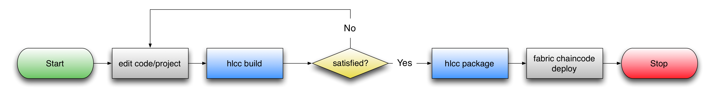

[](https://travis-ci.org/ghaskins/obcc)

# obcc - openblockchain compiler (Work In Progress)

## Introduction

obcc is a proposal for a toolchain to assist in various phases of [openblockchain](https://github.com/openblockchain) chaincode development, such as compilation, test, packaging, and deployment.

### Why?

Current chaincode development is rather unstructured outside of the coarse-level callbacks for invoke or query passing a {function-name, argument-array} string-based tuple.  The result of this is that input translation/validation is a manual, explicit, and likely fragile process in each chaincode function.  Additionally, any potential chaincode consumer needs to study the chaincode source in order to ascertain its API.

Consider that some chaincode applications may employ OBC confidentiality to hide their source, while others may wish to employ alternative programming languages.  This aside, chaincode deployment lifecycles may be long enough to require us to be aware of managing potential API incompatibilities between the chaincode and its clients.  It starts to become clear that there are some advantages to allowing chaincode to express its API interfaces in a way that is independent from the underlying implementation/language and in a manner that supports some form of schema management.

OBCC helps in this regard by allowing applications to declare/consume one or more language neutral interface-definitions and package it with the project.  It helps the developer by generating shim/stub code in their chosen programming language that helps them implement and/or consume the interfaces declared.  This means that external parties may introspect a given instance for its interface(s) in a language neutral manner without requiring access to and/or an ability to decipher the underlying code.  It also means that we can use [protobufs](https://developers.google.com/protocol-buffers/) to help with various API features such as managing forwards/backwards compatibility, endian neutrality, basic type validation, etc in a largely transparent manner.

OBCC provides some other benefits too, such as consistent language-neutral packaging and chaincode hashing, which help to simplify both the obc-peer implementation and developer burden.

## Getting Started

### Prerequisites

- A Java JRE/JDK v1.7 (or higher)

### Installation

   $ make install

### Usage

```
$ obcc -h
obcc version: v0.4

Usage: obcc [general-options] action [action-options]

General Options:
  -v, --version  Print the version and exit
  -h, --help

Actions:
  build -> Build the chaincode project
  buildcca -> Build the chaincode project from a CCA file
  clean -> Clean the chaincode project
  package -> Package the chaincode into a CCA file for deployment
  unpack -> Unpackage a CCA file
  lscca -> List the contents of a CCA file

(run "obcc <action> -h" for action specific help)
```
### Working with OBCC

The idiomatic way to use obcc is to treat it similar to other build tools such as Make, Maven, or Leiningen.  That is, by default it expects to be executed from within your [project root](#project-structure).  Subcommands such as _build_, _clean_, and _package_ fall into this category.  You can run it outside of a project root by using the "-p" switch to these commands to inform OBCC where your project root is when it is not the current directory.

Other commands such as _buildcca_, _unpack_, and _lscca_ are designed to operate against a Chaincode Archive (CCA) from a previous _package_ operation.  These commands expect a path to a CCA file.

In all cases, you may obtain subcommand specific help by invoking "obcc _$subcommand_ -h".  For example:

```
$ obcc package -h
obcc version: v0.4

Description: obcc package - Package the chaincode into a CCA file for deployment

Usage: obcc package [options]

Command Options:
  -o, --output NAME          path to the output destination
  -c, --compress NAME  gzip  compression algorithm to use
  -p, --path PATH      ./    path to chaincode project
  -h, --help
```

### Typical Workflow



### Subcommand Details

#### obcc build

Builds your chaincode project into a binary ready for execution on a blockchain.  Various artifacts are emitted to ./build, depending on the platform.  For com.obc.chaincode.golang:

- ./build/src: shim, protobufs, etc
- ./build/deps: direct and transitive dependencies of your chaincode, as retrieved by "go get".  NOTE: this option is likely to default to disabled in the future, since it is not a good idea for a validating peer to be pulling dependencies down.  Rather, there should be some fixed number of dependencies that are implicitly included with the platform.  For now, we pull things in dynamically.
- ./build/bin: the default location for the binary generated (override with -o)

#### obcc clean

Cleans a chaincode project.  This typically translates to removing the ./build directory, but platforms are free to define this as they see fit and may perform additional or alternative operations.

#### obcc package

Packages the sourcecode, interfaces, chaincode.conf, and other project data into a .cca file suitable for deployment.  Note that any binaries generated are _not_ included but rather will be rebuilt (using _obcc buildcca_) by each validating peer in the network.

Implicitly runs the "lscca" command on the result to display details about the package.

```
vagrant@obc-devenv:v0.0.7-2ec7137:~ $ obcc package -p /opt/gopath/src/github.com/openblockchain/obc-peer/openchain/example/chaincode/cca/example02/
Writing CCA to: /opt/gopath/src/github.com/openblockchain/obc-peer/openchain/example/chaincode/cca/example02/build/com.obc.chaincode.example02-0.1-SNAPSHOT.cca
Using path /opt/gopath/src/github.com/openblockchain/obc-peer/openchain/example/chaincode/cca/example02/ ["src" "chaincode.conf"]
|------+------------------------------------------+------------------------------------------------|
| Size |                   SHA1                   |                      Path                      |
|------+------------------------------------------+------------------------------------------------|
| 456  | fc4ad46e08416ffde454b7dfeeba4270a075ef7f | chaincode.conf                                 |
| 3630 | 55d1754539a3c25033faae53b00022494c70939b | src/chaincode/chaincode_example02.go           |
| 375  | 9492a1e96f380a97bba1f16f085fc70140154c65 | src/interfaces/com.obc.chaincode.example02.cci |
| 143  | 7305f65e18e4aab860b201d40916bb7adf97544f | src/interfaces/project.cci                     |
|------+------------------------------------------+------------------------------------------------|
Platform:            com.obc.chaincode.golang version 1
Digital Signature:   none
Raw Data Size:       4604 bytes
Archive Size:        2315 bytes
Compression Alg:     gzip
Chaincode SHA3:      98493521a198d0a93cc07c4451616efebbe96eb2655dd38357c4e0c495bcae3ff3de14bc2287c70bc6c67968669871dc32164bb48e9765c97fb843a2cd7a0f78
```

#### obcc lscca

Displays the contents of an existing .cca file (see 'obcc package' for an output example)

#### obcc unpack

Unpacks a .cca archive into the filesystem as a chaincode project.

#### obcc buildcca

Combines _unpack_ with _build_ by utilizing a temporary directory.  This allows a project to be built from a .cca file without explicitly unpacking it first, as a convenience.

## Project Structure

Like many modern build tools, OBCC is opinionated.  It expects a specific structure to your project as follows:

- a file [chaincode.conf](./testdata/example02/chaincode.conf) is in the root directory (discussed below)
- your chaincode entry-point in ./src/chaincode ([example](./testdata/example02/src/chaincode/chaincode_example02.go))
- your interface files are in ./src/interfaces ([example](./testdata/example02/src/interfaces/com.obc.chaincode.example02.cci))
- your project defines one project-level interface called ./src/interfaces/project.cci ([example](./testdata/example02/src/interfaces/project.cci))

### chaincode.conf

_chaincode.conf_ is the central configuration file for a given obcc-managed chaincode project.  An example looks like this:

```
# ----------------------------------
# chaincode example02
# ----------------------------------
#
# Copyright (C) 2016 - OpenBlockChain
# All rights reserved
#

Schema:  1
Name:    com.obc.chaincode.example02  # trailing comment test
Version: 0.1-SNAPSHOT

Platform
{
        Name: com.obc.chaincode.golang
        Version: 1
}

Provides: [self] # 'self' is a keyword that means there should be $name.cci (e.g. com.obc.chaincode.example02.cci)
```

All chaincode.conf files may have an arbitrary number of comments (via "#") or whitespace which are summarily ignored.  Aside from whitespace, the real content of your file must start with "Schema: 1" to denote compatibility.  After this, there are 3 primary groups of fields:

- project name/version
- platform
- interface declarations (provides/consumes)

#### Project name/version

This is something that should uniquely identify your chaincode project for human/UX consumption.  It is generally advised that a DNS name of some kind be incorporated to promote global uniqueness.  Note that the OBC subsystem in general does not interpret these names in any meaningful way other than for display purposes.

#### Platform

It is here that a chaincode may declare the compatibility/conformity to a specific platform.  The idea is to promote extensibility (e.g. other platforms may be added in the future) and also compatility (e.g. platform X, version Y may mean something very specifically about the type of chaincode language supported, the ABI for any peripheral libraries, etc).  It is analogous to the notion that java 1.7 is a different ABI than java 1.8, etc.  At the time of writing, the only supported platform is com.obc.chaincode.golang version 1.  More platforms may be added in the future.

##### Adding platforms

The only core requirement is that both OBCC and the chosen OBC network are in agreement to support said platform.  The details of implementing this are "coming soon".

#### Interface Declarations

Interfaces (as included in ./src/interfaces) may be in one or two categories: Provided or Consumed.  _Provided_ means that the chaincode implements the interface and supports having clients or other chaincode invoke methods as declared.  Likewise, _consumed_ indicates that the chaincode expects to perform inter-chaincode invoke/query operations to a disparate chaincode instance that provides the interface.  It is perfectly fine (though perhaps uncommon) for a chaincode to both provide and consume a given interface (such as for proxy contracts which may accept operations in a polymorphic manner before passing operations on to a concrete instance).

Both Provides and Consumes are expressed as an array of 1 or more entries.  For example:

```
Provides: [com.obc.chaincode.example02, com.obc.chaincode.example03]
Consumes: [com.obc.chaincode.example02]
```

If there aren't any interfaces in a particular category, the entry may be omitted.  Note that a chaincode that doesn't provide any interfaces doesn't sound particularly useful, however.  Therefore, it is expected that every project will include at least a Provides clause.

##### "self"

The keyword _self_ may be used as shorthand for an interface that shares the same name as the project (for instance, the com.obc.chaincode.example02 project surfacing the com.obc.chaincode.example02.cci interface), as a convenience.  It is idiomatic for a project to name its primary interfaces after itself, and therefore this shortcut is expected to be commonly used.  Example:

```
Provides: [self]
```

### Chaincode

The opinionated portion of chaincode path solely applies to the entry-point for your application.  Other paths for non-entry point code are generally fine if you are using a language that supports namespaces, etc.  For instance, the com.obc.chaincode.golang platform assumes a $GOPATH of ./src and tries to build "chaincode" (via $GOPATH/src/chaincode).  However, if your chaincode uses go imports such as:

```golang
import (
   "foo"
   "bar/baz"
)
```

placed in ./src/foo and ./src/bar/baz respectively, they will be discovered perfectly fine.

### Interfaces

An interface is a file ending in .cci (Chaincode Interface) that defines a language neutral definition for various RPC-like functions that a given chaincode instance supports.  An chaincode instance may in fact support many different interfaces at one time.  This is convenient for creating a type of polymorphism within a network of chaincode instances.

Each .cci file is meant to represent an interface contract for compatibility.  Items declared within a .cci file have provisions (similar to protobuf indices) for mutating structures over time that do not break forwards or backwards compatibility.  Changes to a given interface should only be done in a manner which exploits this compatibility mechanism.  If for some reason it is mandated that compatibility _must_ be broken, the name of the interface should be changed.

#### Interface names

The name of the .cci file has direct meaning to the ABI: the name of the file will be translated into ABI tokens on the wire.  This was intentionally chosen so that the filesystem itself (under ./src/interfaces) takes a role in ensuring that only one interface of a particular type is in use within a project at any given time.  Likewise, if a project wishes to import and consume an interface from a different project, it is imperative that the filename be retained across both projects or the endpoints will be inadvertently namespace-isolated from one another.  To put it another way, do not rename .cci files on import!

Perhaps even more importantly, interface ABI needs to be globally managed.  Therefore it is advised to name .cci files in a way that is globally unique.  A UUID would suffice, at the expense of being somewhat difficult to humans to deal with.  Therefore, it is advised to name interfaces using DNS names as in the examples provided here.

#### Interface namespaces

Given the potential for multiple interfaces to use conflicting names, there is a need to let a project place specific interfaces in a unique namespace when necessary.  However, it was felt that the default mode should make it as easy as possible for a chaincode developer to work with the system.  Therefore, the default import of an arbitrary .cci file will emit tokens in the global namespace for ease of use.  A future mechanism will be added to the chaincode.conf that will allow a developer to assign arbitrary interfaces to specific namespaces w.r.t. emitted tokens without affecting the wire ABI.  TBD.  For now, note that tokens declared within interfaces files within the same project may not conflict.

#### Definition

Each interface definition loosely adheres to a protobuf-ish syntax.  This was intentional, as the .cci file is actually translated into an intermediate .proto file before being handed to protoc to do the real work.  The reason we did not just use protobuf syntax directly was because it was felt there were a few areas of the protobuf grammar that were suboptimal w.r.t. chaincode definition.  Consider an example .cci:

```
message PaymentParams {
        string partySrc = 1;
        string partyDst = 2;
        int32  amount   = 3;
}

message Entity {
        string id = 1;
}

message BalanceResult {
        int32 balance = 1;
}

transactions {
        void MakePayment(PaymentParams) = 1;
        void DeleteAccount(Entity) = 2;
}

queries {
        BalanceResult CheckBalance(Entity) = 1;
}
```

The _message_ definitions are almost 1:1 with protobuf grammar.  The largest divergence is w.r.t. the _transactions_ and _queries_ sections.  These two are similar to one another as well as to the notion of service/rpc in protobuf grammar.  The reason we diverged is for a few different reasons:

- Chaincode has a strong delineation between and invoke and a query, and it was important for the parser to be able to understand the breakdown so that the proper code could be emitted
- It was felt that the lack of "field indices" in the protobuf service/rpc grammar was a large shortcoming in ABI compatibility.  Therefore, the grammar used here retains the notion of indices even for function calls.

The main purpose of the grammar is to define RPC functions.  For reasons of ABI stability, it was decided that all RPCs will have the following properties:
- Be indexed (e.g. ABI depends on index stability, not function name)
- Accept only 0 or 1 _message_ as input and return only 0 (via _void_) or 1 message as output
- We rely on the message definitions for further ABI stability.

#### "Project" interface

Every project has an implicit interface: project.cci.  This interface is intended to define more system-level interactions such as the "init" or constructor for a given chaincode.  It is also generally assumed to be not something that needs to be shared with other projects in the same manner that application-level interfaces might, thus we are not concerned about "project.cci" name conflicting in the way we care about other interfaces.

The project.cci is also special in another way: it supports an implicit transaction::init() function.  It is expected that every chaincode will need a constructor, and that constructor is a transaction like any other.  However, rather than require every project to explicitly define something like:

```
message MyCtorParams {
        int32 balance = 1;
}

transactions {
        void Init(MyCtorParams) = 1;
}
```
The developer may opt to simply just define a message "Init" and omit the transaction{} entirely.  In this case, the transaction is implied.  For example:

```
message Init {
        int32 balance = 1;
}
```
is equivalent to
```
message Init {
        int32 balance = 1;
}

transactions {
        void Init(Init) = 1;
}
```
when placed within the project.cci
